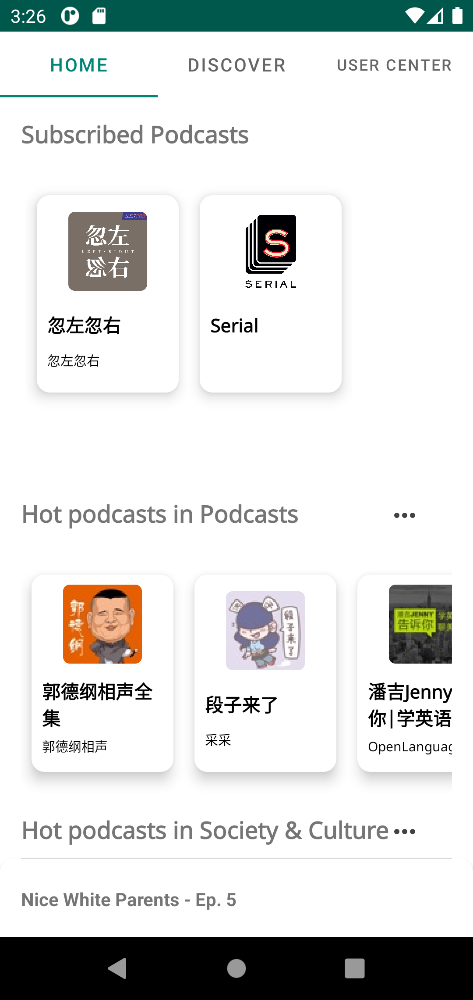
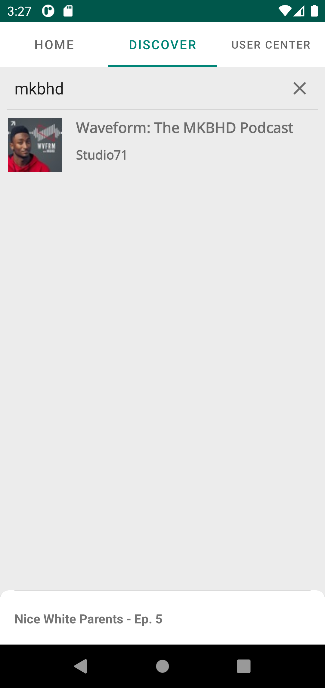
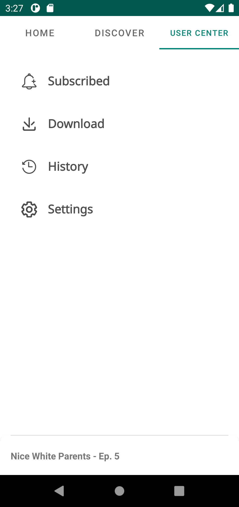
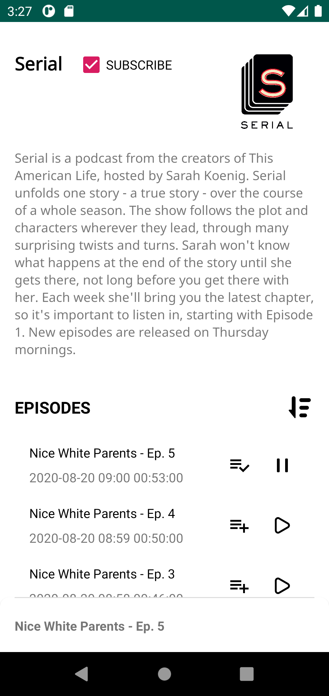
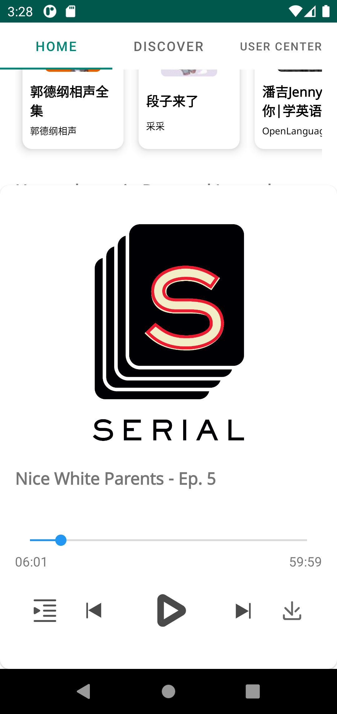

# Bocast: Podcast App (JetPack+MVVM)
---
## Used technology
* Java
* JetPack
* ARouter
* Starrysky
* retrofit
* Okhttp
* Sqlite
* ...

## ScreenShot
Home Screen

Discovery Screen

User Center

Podcast Detail

Player

